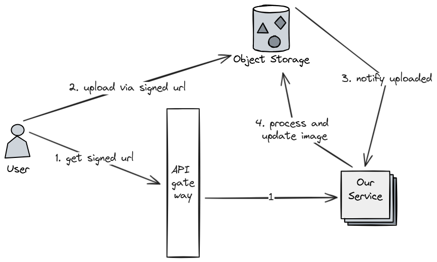

# newsfeed-service

Repository for Bandlab backend test assignment

## Quickstart

### API

More details in: [OpenAPI spec file](./api-spec.yaml)

Host: https://newsfeed-service-ogwuwsx3mq-de.a.run.app

For simplicity the auth_token is used as a user ID so `Bearer abcd` means userID = `abcd`

- Create a post

```curl
curl --location 'https://newsfeed-service-ogwuwsx3mq-de.a.run.app/posts' \
--header 'Content-Type: application/json' \
--header 'Authorization: Bearer auth_token' \
--data '{
    "caption": "hello world",
    "image_url": "http://url"
}'
```

- Create a comment on a specific post, example: postID = 9

```curl
curl --location 'https://newsfeed-service-ogwuwsx3mq-de.a.run.app/posts/9/comments' \
--header 'Content-Type: application/json' \
--header 'Authorization: Bearer auth_token_2' \
--data '{
    "content": "yoooooooooo"
}'
```

- Get all posts with latest 2 comments in each post

```curl
curl --location 'https://newsfeed-service-ogwuwsx3mq-de.a.run.app/posts?cursor_id=6&page_size=2' \
--header 'Authorization: Bearer auth_token'
 ```

- Delete a comment, example: commentID = 7. **Note** both commentID and auth token must match since we should not be
  able to delete another person's comment

```curl
curl --location --request DELETE 'https://newsfeed-service-ogwuwsx3mq-de.a.run.app/comments/7' \
--header 'Authorization: Bearer auth_token_2'
```

Mock APIs:

- Generate a signed url to upload image

```curl
curl --location --request POST 'https://newsfeed-service-ogwuwsx3mq-de.a.run.app/posts/images' \
--header 'Authorization: Bearer auth_token'
```

**Note:** Letting user upload to our service wastes a lot of bandwidth especially for the API gateway.\
It's generally better to let user upload directly to storage via a signed url with fast expiration.\
For validation requirements, we can configure it using Bucket policy from the cloud provider

- Webhook API called after an image is uploaded successfully to cloud storage. This API can then resize and convert the
  uploaded image to JPG 600x600 and replace it in the same URL

```curl
curl --location --request PUT 'https://newsfeed-service-ogwuwsx3mq-de.a.run.app/posts/images' \
--header 'Content-Type: application/json' \
--header 'Authorization: Bearer cloud_token' \
--data '{
    "bucket": "post-image-bucket",
    "path": "userid/uuid",
}'
```



### Running locally

Using `docker` or `podman`

```shell
podman build . -t newsfeed 
podman run -t -p 8080:8080/tcp localhost/newsfeed
```

or with Go version 1.22 or greater

```shell
go run main.go
```

## Structure

- `main.go`: is the entry point of the program, contains list of routes for the service
- `config`: stores configuration in an object, loaded from file or environment variables
- `constants`: for constants reused by many packages
- `domains`: declares request, response data format
- `handlers`: contains web handler in charge of parsing, validation and calling the right service
- `middlewares`: for special types of handler that applies to many endpoints, such as authentication
- `migrations`: contains SQL migration scripts
- `models`: declares entities that map to database
- `services`: contains the majority of business logic
- `storage`: an interface between the app and external storage, mainly how the database is used

### Production-ize

Code:

- Use a proper library to load config
- Remove embedded Postgres database and connect to a real one
- Add tracing
- Add a real object storage API client
- Add a cloud function to validate and resize that runs when an image is uploaded to object storage

Deployments:

- Setup a SQL database and run initial migration
- Rebuild and push the image to internal repository
- Provide correct environment variables to Kubernetes
- Deploy to Kubernetes using said image